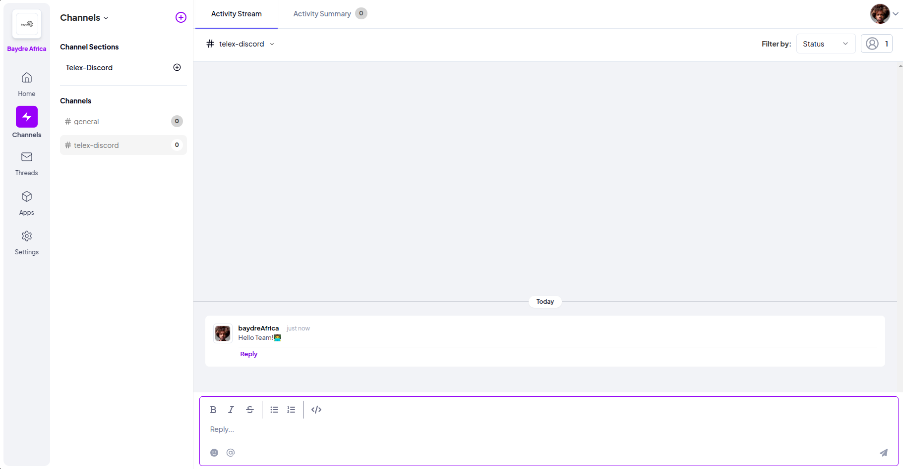

# Telex to Discord Webhook

This project integrates Telex with Discord by forwarding messages received from Telex to a specified Discord channel using webhooks.

## Prerequisites

- Python 3.8 or higher
- FastAPI
- `python-dotenv` for managing environment variables
- `requests` library for making HTTP requests

## Installation

1. Clone the repository:
   ```bash
   git clone https://github.com/your-username/telex_discord_integrations.git
   cd telex_discord_integrations
   ```

2. Create and activate a virtual environment:
   ```bash
   python -m venv venv
   source venv/bin/activate  # On Windows use `venv\Scripts\activate`
   ```

3. Install the required dependencies:
   ```bash
   pip install -r requirements.txt
   ```

4. Create a .env file in the root directory and add your Discord webhook URL:
   ```plaintext
   DISCORD_WEBHOOK_URL=your_discord_webhook_url_here
   ```

## Usage

1. Run the FastAPI application:
   ```bash
   uvicorn main:app --reload
   ```

2. Configure Telex to send POST requests to the `/telex-webhook` endpoint of your FastAPI application. The URL should look like this:
   ```
   https://127.0.0.1:8000/telex_webhook
   ```

3. Ensure the Telex webhook payload includes a `content` field in the JSON body:
   ```json
   {
       "content": "Hello, Discord!"
   }
   ```

## Example Telex Webhook Configuration

Here is an example configuration for the Telex webhook:
```json
{
    "url": "https://127.0.0.1:8000/telex_webhook",
    "method": "POST",
    "headers": {
        "Content-Type": "application/json"
    },
    "body": {
        "content": "Hello, Discord!"
    }
}
```
## Screenshots




## Project Structure

    telex_discord_webhook/
├── app/
│   ├── __init__.py
│   ├── main.py
│   ├── models.py
│   ├── api/
│   │   ├── __init__.py
│   │   ├── endpoints.py
│   ├── core/
│   │   ├── __init__.py
│   │   ├── config.py
│   ├── utils/
│   │   ├── __init__.py
│   │   ├── discord.py
├── tests/
│   ├── __init__.py
│   ├── test_main.py
├── .env
├── requirements.txt
├── README.md

## License

This project is licensed under the MIT License. See the LICENSE file for details.

## Contributing

Contributions are welcome! Please open an issue or submit a pull request for any improvements or bug fixes.

## Contact

For any questions or inquiries, please contact [baydreafrica@gmail.com](mailto:baydreafrica@gmail.com).